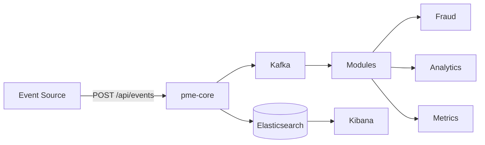

# Processing Modular Events

**Plateforme de traitement d'evenements modulaire** — Un moteur event-driven avec un systeme de modules ouvert, inspire d'Obsidian et Grafana.

---

## Comment ca marche

Un **core** ingere des evenements en temps reel via Apache Kafka. Des **modules** independants se greffent dessus pour traiter ces evenements — detection de fraude, analytics, metriques, ou n'importe quelle logique metier.

N'importe quel developpeur peut creer son propre module en important le SDK (`pme-sdk`).

```
Evenement -> Core (Kafka + Elasticsearch) -> Modules (plug-and-play)
```

## Repositories

| Repo | Description | |
|------|-------------|---|
| [`pme-sdk`](https://github.com/Processing-Modular-Events/pme-sdk) | SDK pour developper des modules |  |
| [`pme-core`](https://github.com/Processing-Modular-Events/pme-core) | Moteur — Spring Boot, Kafka, Elasticsearch |  |
| [`pme-module-fraud`](https://github.com/Processing-Modular-Events/pme-module-fraud) | Module de detection de fraude |  |
| [`pme-module-analytics`](https://github.com/Processing-Modular-Events/pme-module-analytics) | Module d'agregation et d'analyse |  |
| [`pme-module-metrics`](https://github.com/Processing-Modular-Events/pme-module-metrics) | Module de metriques temps reel |  |
| [`pme-docs`](https://github.com/Processing-Modular-Events/pme-docs) | Documentation SDK (MkDocs) |  |

## Architecture



## Stack

Java 25 · Spring Boot 3.x · Apache Kafka · Elasticsearch · Kibana · Docker

## Licence

MIT — Built by [@capellegab](https://github.com/capellegab)
